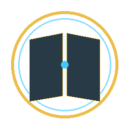
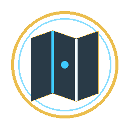
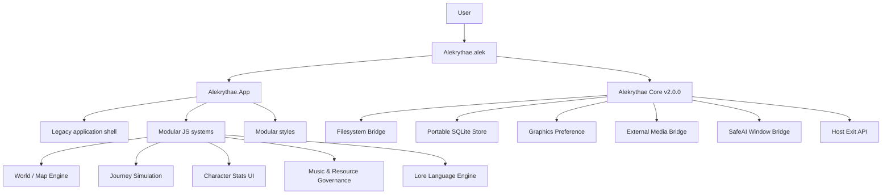
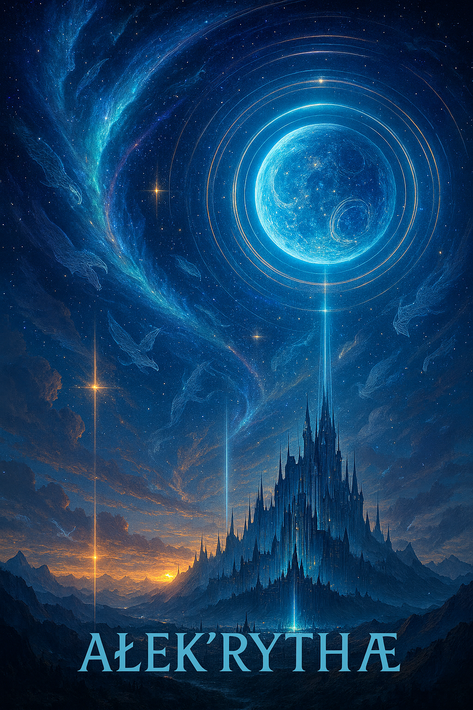

<div align="center">


# 🌙 Meggy JOA · Journey of Adventurer + Tavern

### A persistent fantasy campaign workspace where **world, character, travel, time, inventory, cartography, dialogue and lore live in one stateful system.**

<br>

&nbsp;&nbsp;&nbsp;

&nbsp;&nbsp;&nbsp;

<br><br>


<br>


<br><br>

**Not a spreadsheet with a fantasy skin. Not a pile of disconnected character sheets.  
JOA is a world-state machine for adventures.**

[Features](#-what-joa-actually-does) ·
[Visual Tour](#-visual-tour) ·
[Quick Start](#-quick-start) ·
[Controls](#-command-atlas--shortcut-cheat-sheet) ·
[Architecture](#-architecture) ·
[Documentation](#-documentation) ·
[Türkçe](#-türkçe-hızlı-tanıtım)

</div>

---

## ✦ The idea

Most tabletop and narrative tools split a world into separate islands:

- one page for characters,
- another for inventory,
- another for maps,
- another for notes,
- another for quests,
- another for time,
- another for dialogue,
- and usually no real relationship between any of them.

**JOA takes the opposite approach.**

A character can exist in a location.  
A location can exist in a realm.  
A group can contain characters and mounts.  
A ship can carry people.  
A pawn can move across a world layer.  
Movement can consume time.  
Time can affect stamina and recovery.  
Metanet can decide whether a character can even speak.  
A Tavern conversation can advance the same game clock used by travel.  
An entity removed from the active world can still be recovered from the Forgotten Vault.

That shared state is the point.

> **A world should remember what happened to it.**

---

# 🌌 What JOA actually does

JOA v1.0.0 combines multiple systems under one Adventure:

| Domain | What JOA models |
|---|---|
| 🧬 **Entities** | Characters, beings, species, peoples, groups, dynasties, societies, civilizations, locations, structures, geography, vehicles, systems and more |
| 🌍 **World** | Four map layers, persistent pawn placement, focus, pinning, containers, regions and discovery |
| 🧭 **Travel** | Travel preparation, groups, speed, distance, destination containers, stamina and game-time cost |
| 👁️ **Exploration** | Vision range, discovered territory and fog-style world revelation |
| ❤️ **Resources** | Health, Mana, Stamina and Metanet with independent recovery rules |
| 🎒 **Inventory** | 24 item classes, quantities, giving, trading and stack splitting |
| 📜 **Narrative** | Journal, quests, lore records, checklists and date-bound entries |
| 🧠 **Character systems** | Identity, canonical races, hybrids, stats, skills, death/life state and modular sheet systems |
| 🎨 **Cartography** | Paint tools, 24 brushes, regions, layers, opacity, image layers, visibility and locking |
| 🕰️ **Time** | A custom Ałek’ryŧhæ calendar, waiting, first aid, camp and inn recovery |
| 🍺 **Tavern** | Encounters, speakers, dialogue history, image messages and speech-time accounting |
| 🗃️ **Persistence** | Adventure databases, autosave, import/export, migration paths and recoverable deletion |
| ✨ **Language & glyphs** | Ałek’ryŧhæ symbol palette and the embedded lore-language engine |
| 🤖 **Assistant surface** | SafeAI/Core-hosted Assistant integration without embedding API credentials into JOA |

---

# 🎞️ Visual tour

<div align="center">

### The Gateway


*Every Adventure begins as its own persistent world domain.*

<br><br>

### Meggy


*Meggy is present as a distinct Tavern/assistant identity rather than being treated as an ordinary character resource pool.*

<br><br>

### The Blue Moon


*F4 does not brutally kill the application. JOA uses the Blue Moon as a deliberate farewell/exit gate.*

<br><br>

### The Taxonomy Circle


*The world is not limited to “character” and “place.” JOA provides a 24-type taxonomy for building a structured setting.*

</div>

---

# 🧬 A world made of cards, not flat lists

The **Mevcudat** surface is the heart of JOA's world model.

Press **F1** and you are not opening a simple inventory screen. You are opening the living entity tree of the Adventure.

An entity can:

- have its own identity,
- have its own sheet,
- contain other entities,
- be contained by another entity,
- have a map pawn,
- have a position in a world layer,
- own personal resources,
- hold inventory,
- keep journal and quest data,
- participate in Tavern scenes,
- be removed from the Map without being deleted,
- or be archived into the Forgotten Vault.

### Example world hierarchy

```text
Realm
└── Land
    └── Settlement
        └── Harbor
            └── Ship
                ├── Captain
                ├── Navigator
                ├── Passenger
                └── Cargo / sub-entities
```

That hierarchy is not decorative. It influences how the world is organized and how entities can appear on the Map.

---

# 🜂 The 24-card Taxonomy Circle

JOA provides twenty-four canonical world-card categories.

## I · Living beings and lineages

| # | Card | Purpose |
|---:|---|---|
| 01 | **Character** | An individual person |
| 02 | **Being** | An individual non-human creature/entity |
| 03 | **Species** | Biological or inherited origin |
| 04 | **People** | Cultural identity/community |
| 05 | **Group** | Party, unit, crew, herd or caravan |
| 06 | **Dynasty** | Bloodline, family, succession |

## II · Societies and orders

| # | Card | Purpose |
|---:|---|---|
| 07 | **Society** | Guild, academy, company, cult, order |
| 08 | **Sovereignty** | Political or governing structure |
| 09 | **Civilization** | Long-lived culture, knowledge and legacy |
| 10 | **Settlement** | Village, city, colony, camp, station |
| 11 | **Land** | Regional territory |
| 12 | **Plane** | A separate physical, temporal or reality order |

## III · Places and cosmos

| # | Card | Purpose |
|---:|---|---|
| 13 | **Location** | Room, cave, street, local scene |
| 14 | **Structure** | House, castle, tower, palace, megastructure |
| 15 | **Geography** | Mountain, river, sea, desert, forest |
| 16 | **Habitat** | Biome or artificial biosphere |
| 17 | **Celestial Formation** | Planet, star, moon, cosmic anomaly |
| 18 | **Flying Island** | A moving, airborne or wandering world fragment |

## IV · Objects and systems

| # | Card | Purpose |
|---:|---|---|
| 19 | **Item** | A general trackable object |
| 20 | **Mount / Vehicle** | Horse, ship, machine, spacecraft |
| 21 | **Mechanism** | Machine or functioning mechanism |
| 22 | **Facility** | Factory, laboratory, base, production complex |
| 23 | **Resource** | Water, ore, energy, food reserve |
| 24 | **Network** | Roads, portals, communications, energy grids |

The taxonomy UI is not only a picker. Its design includes guidance for **when a card type should be used, what it contributes to the story, what it naturally connects to, and what it can contain.**

---

# 🧝 Character identity, races and hybrids

A character sheet can carry:

- name,
- title,
- gender,
- race/origin,
- portrait,
- narrative information,
- modular gameplay systems.

JOA includes a **24-race canonical Ałek’ryŧhæ framework** and also supports:

- a canonical race,
- a **Hybrid** built from multiple roots,
- an **Outer Realm** free-form origin.

The goal is not to force every campaign into one biological model. The canonical setting can remain strict while external worlds still have a place to enter.

---

# ⚔️ The 24-Stat Circle

Stats are organized as a broad capability model rather than a short RPG trio.

| Domain | Stats |
|---|---|
| **Structure** | Durability · Balance · Capacity |
| **Physical execution** | Might · Agility · Mobility |
| **Cognition** | Comprehension · Focus · Memory |
| **Will & control** | Will · Control · Productivity |
| **Defense** | Absorption · Deflection · Protection |
| **Effect** | Impact · Accuracy · Reach |
| **Perception** | Perception · Sensitivity · Awareness |
| **Expression** | Expression · Influence · Coordination |

The current source uses **8** as the default canonical stat value and leaves room for additional/custom fields.

---

# ❤️ Four personal resource systems

<div align="center">

<br>
<br>
<br>


</div>

JOA tracks four main personal pools:

### ❤️ Health

Damage, healing, maximum Health and natural recovery.

### ✦ Mana

Spendable Ałek/magical reserve with maximum and regeneration.

### ⚡ Stamina · Takat

Physical action and travel depend on Stamina. Full exhaustion can prevent physical activity while non-physical records such as Sheet, Bag, Journal, Quests and Mevcudat remain accessible.

### ◇ Metanet

Metanet represents the character's ability to remain active and socially present over time.

A fully collapsed character cannot participate in Tavern speech.  
Dialogue becomes available again when Metanet recovers to **50% or above**.

This makes rest more than a cosmetic “skip time” button.

---

# ☠️ Death, life and protected entities

JOA contains death/life state behavior rather than simply deleting a character when Health reaches zero.

A death seal can:

- mark a character dead,
- zero Health,
- zero Mana reserve,
- zero Stamina,
- zero Metanet,
- preserve pre-death values for restoration logic.

The system also has concepts for immortal/protected entities that should not casually disappear from the world model.

---

# 🎒 Inventory that understands transactions

<div align="center">






</div>

JOA currently defines **24 canonical item classes**:

`Weapon` · `Armor` · `Tool` · `Ammunition` · `Clothing` · `Accessory` · `Container` · `Food` · `Drink` · `Medicine` · `Potion` · `Material` · `Ore` · `Plant` · `Component` · `Device` · `Key` · `Document` · `Book` · `Map` · `Currency` · `Jewel` · `Relic` · `Other`

Inventory supports more than CRUD:

- create an item,
- edit an item,
- keep quantities,
- remove/discard,
- multi-select,
- **Give** items to another target,
- **Trade** between two parties,
- **Split** a stack into separate quantities.

While an inventory transaction flow is active:

- **Space** advances/confirms,
- **Esc** cancels.

Targets can be selected through Mevcudat where appropriate.

---

# 🧠 Skills are persistent character data

The Skills system supports:

- categories,
- new skill creation,
- name and description editing,
- EXP values,
- custom skill artwork,
- image replacement/removal,
- edit locking.

Skill data belongs to the character's persistent sheet rather than living in a temporary encounter window.

---

# 📖 Journal: memory for the campaign

The Journal has broad default families such as:

- **Personal Notes**
- **Discoveries**
- **Lore & History**

Users can build their own category trees.

Entries can carry:

- title,
- lore/notes,
- checklist items,
- date,
- category.

The point is simple: world knowledge belongs to the world state.

---

# 🗡️ Quests: more than one generic checklist

The quest framework ships with a rich set of fantasy-oriented category families, including themes equivalent to:

- Call of the Journey
- Lament of the Hero
- Eternal Vows
- Fruits of the Hybrids
- Companions & Blood Bonds
- Guilds & Societies
- Across My Realm
- Dark & Forbidden
- Open Waters & Windy Sails
- Forge, Trade & Coin

Main categories, subcategories and task/checklist entries can be extended by the user.

---

# 🗺️ Four world layers

Press **F2** to enter the Map.

JOA does not treat “the map” as a single flat canvas.

| Key | World layer |
|---|---|
| **1** | 🌍 Surface |
| **2** | ☁️ Sky / Flying Island |
| **3** | ⛏️ Underground |
| **4** | ✦ Cosmic Island |

Layer-aware world/camera state allows different spatial contexts to coexist inside one Adventure.

### Pawn footprint contract

- **Character:** `1 × 1 m`
- **Group:** `3 × 3 m`
- **Location:** `5 × 5 m`

---

# 👁️ Vision, discovery and the unknown

A character's **Vision Range** feeds world exploration.

Vision can contribute to:

- discovered regions,
- revealing previously unseen territory,
- opening new areas while movement occurs.

The Journey module can be disabled per character. When it is disabled, that character is intended to opt out of map vision, travel and personal recovery behavior.

This lets purely narrative/non-travelling entities remain in the same world database without pretending every card is an adventurer pawn.

---

# 🧭 Travel is a process, not teleportation

JOA's travel system is designed around prepared movement.

Typical flow:

1. Enter travel mode with **S**.
2. Select the travelling pawn/entity.
3. Prepare a route or destination.
4. Optionally hold **E** when the intended destination is **inside another container/entity**.
5. Prepare additional routes if required.
6. Press **Space** to execute prepared travel.

Travel can interact with:

- distance,
- character movement speed,
- Stamina,
- game time,
- vision,
- discovered territory.

`Esc` remains the primary cancellation path.

---

# 👥 Travel Groups

Press **G** to create an independent Travel Group.

A Travel Group can act as:

- a shared moving party,
- a portable container,
- a way to move multiple world entities together.

Important interactions include:

- **Middle click:** open Internal/Portable Containers where appropriate.
- **Right click:** disband an independent Travel Group.
- **Right click an entity inside a portable list:** eject it near the carrier.

So a group is not merely a visual selection rectangle. It can participate in the same containment model as the rest of the world.

---

# 📦 Internal Containers

One of JOA's less obvious systems is the ability to inspect what a map pawn contains **without leaving the Map**.

Examples:

- passengers in a ship,
- members in a party,
- characters in a location,
- entities nested inside a carrier.

This gives the Map a second dimension: **position outside + structure inside.**

---

# 🎨 Cartography is a real editor

JOA contains a deeper painting/cartography system than the old in-app help originally advertised.

### Open it

**Tap Shift briefly and release.**

The palette distinguishes a short Shift tap from ordinary modifier use.

### Palette controls

| Key | Tool |
|---|---|
| **F** | Paint |
| **E** | Eraser |
| **A** | Eyedropper |
| **Ctrl + Z** | Undo latest paint operation |

With the palette open:

- **Alt + left drag** adjusts brush size,
- **Alt + right drag** adjusts softness.

### 24 brush presets

1. Hard Square
2. Hard Circle
3. Hard Diamond
4. Cross Tip
5. Soft Circle
6. Soft Square
7. Fine Spray
8. Wide Spray
9. Light Dither
10. Dense Dither
11. Horizontal Hatch
12. Rough Scatter
13. Thin Chisel
14. Wide Chisel
15. Transparent Wash
16. Soft Wide
17. Fine Grain
18. Scattered Dot
19. Cross Hatch
20. Air Brush
21. Blur
22. Very Soft
23. Outline Tip
24. Filled Block

### Brush properties

The palette can work with:

- color,
- hue,
- saturation,
- lightness,
- opacity,
- size,
- softness.

---

# 🧩 Regions, paint layers and image layers

Cartography is not a single irreversible bitmap.

JOA supports concepts for:

- regions,
- region boundaries,
- active layers,
- visibility,
- ordering,
- moving layers between regions,
- constraining new painting to active region boundaries.

External images can be attached to image layers and then:

- positioned,
- dragged,
- resized,
- hidden,
- locked,
- unlocked,
- removed from the map layer.

Removing the map-layer reference does not mean deleting the original source image from disk.

---

# 🕰️ Time Hearth

Press **T** to open **Time Hearth · Rest and Time Skip**.

JOA's progression is **action-driven** rather than blindly tied to the real-world clock.

### Canonical Ałek’ryŧhæ time scale

| Unit | Scale |
|---|---|
| 1 game minute | 24 game seconds |
| 1 hour | 240 minutes |
| 1 day | 36 hours |
| 1 month | 24 days |
| 1 year | 24 months |

### Recovery modes

| Rest mode | Health | Mana | Stamina | Metanet | Notes |
|---|---:|---:|---:|---:|---|
| **Wait** | ×1.00 | ×1.00 | ×0 | ×0 | Awake Metanet drain continues |
| **First Aid** | ×1.75 | ×1.10 | ×0 | ×0 | Awake Metanet drain continues |
| **Camp** | ×2.25 | ×1.75 | ×1.15 | ×1.60 | Sleep suppresses fixed Metanet drain |
| **Bed / Inn** | ×3.00 | ×2.50 | ×1.60 | ×2.00 | Strongest natural recovery |

Days, hours and minutes can be entered directly.

This means time skipping is connected to the resource model rather than being a purely cosmetic calendar edit.

---

# 🍺 Tavern: encounters become history

The Tavern is JOA's encounter/dialogue stage.

### Start an encounter

Press **B** on the Map to begin a new encounter with appropriate participants.

A character can also be brought into the Tavern through the conversation seal in Mevcudat.

### Speak as different participants

Inside Tavern you can:

- write dialogue, narration or action,
- send through **Meggy**,
- send through a selected character,
- remove a speaker from the stage.

### Speech can cost game time

Character dialogue can estimate spoken duration from text length and advance the same game clock used by the rest of the Adventure.

Meggy is treated differently:

> **Meggy dialogue is outside ordinary game-time speech cost.**

Image-only messages also avoid ordinary speech-time advancement.

### Metanet matters here too

A character whose Metanet has collapsed cannot speak.  
Recover to **50%+** to return to Tavern dialogue.

That connection is exactly what JOA is about: systems meeting each other instead of living on separate pages.

---

# 🖼️ Tavern images

Tavern messages can include images.

The current interaction supports:

- opening image selection from the Tavern context,
- previewing a pending image,
- removing the pending image,
- enlarging a sent image.

Messages can persist:

- speaker,
- text,
- glyph/lore rendering,
- image,
- estimated duration,
- selected game-day context.

Deletion uses a protected confirmation flow.

---

# 🤖 Assistant · GPT surface

Press **F3** to enter the Assistant surface.

JOA delegates this to the **Core SafeAI/native-window bridge** rather than shipping an OpenAI API key inside the repository.

That distinction matters:

- JOA does **not** need to hard-code a personal OpenAI key,
- JOA does **not** ship your ChatGPT password,
- JOA does **not** ship browser session cookies as project files,
- the host/browser side remains responsible for the user's own authenticated session.

If the required Core capability is unavailable, JOA can present a fallback/error state instead of pretending the integration exists.

---

# 🗃️ Forgotten Vault

Deleting an entity from an RPG world is often too destructive.

JOA therefore contains the **Forgotten Vault**.

Eligible removed entities can be stored as a recoverable batch rather than being immediately erased forever.

A root entity can bring its contained subtree with it.

Vault actions include:

- **Restore / Geri Çağır**
- **Delete Forever / Sonsuza Sil**

Canonical, protected, immortal or explicitly undeletable records can be shielded from normal removal logic.

This is intentionally different from **Remove from Map**, which only removes the pawn representation and leaves the entity itself alive in Mevcudat.

---

# 💾 `.alekdata` Data Vault

JOA includes a portability layer for Adventure data.

Top-level utilities provide:

- **↥ Export**
- **↧ Import**

The native import path is designed to recognize multiple historical/current forms:

- `.alekdata`
- older Meggy `.zip` packages
- `meggy.db`
- `game.db`
- legacy `.json` data

The migration flow is designed around:

1. backing up current data,
2. adapting older schema/state,
3. avoiding destructive name/folder collisions,
4. refreshing the runtime when migrated data becomes active.

Portable fallback packages can perform file-size and **SHA-256 integrity checks** and reject unsafe traversal-style paths.

---

# 💿 Autosave

JOA uses delayed/debounced autosave for many edits.

The practical model:

- ordinary edits do not demand a manual Save click every few seconds,
- important transitions can force persistence,
- import can temporarily suspend autosave while data is being replaced/migrated.

For that reason, prefer the normal **F4 → Blue Moon** exit path instead of forcibly terminating the host process.

---

# 🌙 The Blue Moon exit gate

F4 is intentionally ceremonial.

It does **not** mean “kill the window immediately.”

1. Press **F4**.
2. The Blue Moon farewell scene appears.
3. `Esc` cancels.
4. Moon click / `Enter` / `Space` confirms.
5. After the final transition, JOA requests host exit through Core.

It gives the application a deliberate ending instead of a trapdoor.

---

# ✍️ Ałek’ryŧhæ Symbol Palette

Press **Alt + G** to open the symbol/glyph palette.

It can help insert:

- glyphs,
- special symbols,
- Ałek’ryŧhæ alphabet signs,
- named marks

into compatible text fields.

The palette is draggable and can preserve its position/open state.

---

# 🔤 Embedded Lore Language Engine

`lore-language.module.js` is a real preload module in the application manifest.

The source contains support for:

- Roman ↔ glyph transformations,
- a 240-symbol alphabet framework,
- dictionaries,
- generated lexicon,
- word-family analysis,
- batch `.md` / `.txt` conversion,
- custom dictionary import/export,
- snapshots/manifests,
- copy/save workflows.

This engine exists in the package, but JOA v1.0.0 does **not** currently expose a large standalone “Language Engine” button among the primary F1/F2/F3 surfaces. It is therefore best understood as an embedded capability rather than a primary screen.

---

# 🪐 Adventure Manager

An Adventure is an independent campaign/world container.

The manager supports:

- creating a new Adventure,
- opening an Adventure,
- setting/editing cover art,
- renaming,
- deleting,
- showing the active Adventure.

Each Adventure is intended to maintain independent persistent state so one campaign does not become a soup of another campaign's characters, Tavern logs and map positions.

---

# 🎭 Modular character sheets

A character can independently enable or disable major sheet modules:

- **Class**
- **Stats**
- **Journey & Recovery**

That last toggle is important.

A character whose Journey module is disabled is intended to opt out of:

- map vision,
- travel,
- personal recovery behavior.

This supports NPCs, abstract entities and narrative records without forcing every card through the exact same simulation pipeline.

---

# 🎛️ Command Atlas · Shortcut cheat sheet

## Global

| Shortcut | Function |
|---|---|
| **F1** | Mevcudat |
| **F2** | Map |
| **F3** | Assistant |
| **F4** | Blue Moon exit |
| **F11** | Core true fullscreen |
| **Esc** | Cancel/close highest-priority temporary operation |
| **Alt + G** | Ałek’ryŧhæ Symbol Palette |
| **Ctrl + mouse wheel** | UI/WebView zoom intentionally blocked |
| **Tab** | Intentionally consumed/disabled by JOA shortcut contract |

## Mevcudat

| Shortcut / action | Function |
|---|---|
| **K** | Open creation / taxonomy flow |
| **Left click** | Open card/detail |
| **Right click** | Expand/collapse subtree |
| **Drag & drop** | Re-parent / place an entity inside another |
| **Ctrl + Left click** | Toggle multi-selection |
| **Ctrl + Alt** | Clear JOA multi-selection |
| **Delete** | Begin entity removal / Vault flow |
| **Ctrl + E** | Arm one-shot **Place on Map**, then click a card |
| **Ctrl + F** | Arm one-shot **Find/Focus on Map**, then click a card |
| **Esc** | Cancel one-shot command/current selection |

## Map

| Shortcut / action | Function |
|---|---|
| **1 / 2 / 3 / 4** | Switch world layer |
| **Left click** | Select/interact |
| **Double click pawn** | Pin/unpin |
| **Middle mouse drag** | Pan |
| **Mouse wheel** | Zoom |
| **Hold F** | Focus behavior |
| **K** | Create Location + placement flow |
| **G** | Create Travel Group |
| **T** | Open Time Hearth |
| **B** | Start encounter |
| **S** | Toggle travel mode |
| **Hold E** | Enter-target-container travel intent |
| **Space** | Execute prepared travel |
| **Middle click pawn** | Internal/Portable Containers where supported |
| **Esc** | Cancel top Map operation |

## Cartography Palette

| Shortcut | Function |
|---|---|
| **Short Shift tap** | Open/close palette |
| **F** | Paint |
| **E** | Erase |
| **A** | Eyedropper |
| **Ctrl + Z** | Undo latest paint action |
| **Alt + left drag** | Brush size |
| **Alt + right drag** | Brush softness |

## Inventory flows

| Shortcut | Function |
|---|---|
| **Space** | Advance/confirm current flow |
| **Esc** | Cancel current flow |

---

# 🧱 Architecture

JOA is designed as an `.alek` application hosted by **Ałek’ryŧhæ Core v2.0.0**.



### Manifest-loaded application pieces

The v1.0.0 application manifest coordinates:

- native renderer preload,
- lore-language preload,
- legacy application shell,
- lifecycle,
- performance,
- resource governor,
- music,
- GPU auto-selection,
- shortcuts,
- journey simulation,
- world profile,
- surface taxonomy,
- chunk generation,
- JOA world module,
- canonical character UI,
- dedicated stylesheets.

The result is intentionally hybrid: a proven large application shell surrounded by increasingly modular subsystems.

---

# 📦 Repository at a glance

The current v1.0.0 package contains approximately:

| Package element | Count |
|---|---:|
| Total application files | **388** |
| Asset files under `Assets/` | **346** |
| PNG assets | **98** |
| MV voice clips | **240 MP3 files** |
| JavaScript source files | **22** |
| Modular JS modules | **14** |
| CSS files | **3** |
| Core regression/unit-style test files | **3** |

These numbers describe the current v1.0.0 source package and can naturally change in later releases.

---

# 🧪 Verification status

The v1.0.0 release-fix pass was checked against the current package structure.

| Verification | Result |
|---|---|
| Boot-loader contract | **13 / 13 PASS** |
| UI contract | **11 / 11 PASS** |
| World engine test | **PASS** |
| Active old `Alekrythae-R5.alek` references after rename | **0** |
| Root vs app manifest synchronization | **PASS** |
| JavaScript / `.alek` syntax pass used during release-fix verification | **PASS** |

> These checks validate source/package behavior and regression contracts. They do not replace real Windows + Core + WebView2 end-to-end testing on every possible machine.

---

# 🔐 Repository & data hygiene

JOA's source tree deliberately separates application code from live user state.

The repository `.gitignore` is intended to keep runtime material such as:

- `Data/`,
- `Games/`,
- `Backups/`,
- local SQLite runtime databases,
- WAL/SHM files,
- `.env` files,
- private keys,
- credential files,
- temporary/test artifacts

out of source control.

At the same time, the canonical empty template database can remain tracked:

```gitignore
**/game.db
!Templates/Alekrytha/game.db
```

That distinction matters:

> **Template data belongs to the application. Live Adventure data belongs to the user.**

---

# 🤖 No personal GPT credentials belong in this repository

JOA's Assistant integration is host-mediated.

The repository should never contain:

- personal ChatGPT passwords,
- browser cookies,
- OpenAI access/session tokens,
- refresh tokens,
- private API keys,
- Chrome `Login Data`,
- browser `Cookies`,
- browser `User Data` profiles.

The SafeAI/browser responsibility remains outside the JOA source package.

If you fork JOA, keep it that way.

---

# 🚀 Quick start

## Requirements

- **Windows**
- **Ałek’ryŧhæ Core v2.0.0**
- Microsoft Edge **WebView2 Runtime** through the Core host environment

## Launch

Keep the package structure intact and open:

```text
Alekrythae.alek
```

with Ałek’ryŧhæ Core.

Do **not** separate the `.alek` entry file from the `Alekrythae.App` directory. The application loads modular JavaScript/CSS resources from that package structure.

---

# 📁 Repository structure

A simplified view:

```text
.
├─ Alekrythae.alek
├─ manifest.json
├─ VERSION
├─ README.md
├─ SECURITY.md
├─ .gitignore
│
├─ Alekrythae.App/
│  ├─ manifest.json
│  ├─ legacy/
│  │  └─ legacy-app.js
│  ├─ modules/
│  │  ├─ application/
│  │  ├─ character-stats/
│  │  ├─ journey-simulation/
│  │  ├─ joa-world/
│  │  └─ world-map/
│  └─ tests/
│
├─ Assets/
│  ├─ mv-voice/
│  ├─ item-types/
│  ├─ resource-bars/
│  ├─ taxonomy/
│  └─ ...
│
├─ Templates/
│  └─ Alekrytha/
│     └─ game.db
│
├─ Tools/
│  ├─ package.json
│  ├─ regression scripts
│  └─ diagnostics
│
└─ docs/
   ├─ USER_GUIDE_TR.md
   ├─ USER_GUIDE_EN.md
   └─ IN_APP_GUIDE_AUDIT_TR_EN.md
```

Runtime-generated user directories such as `Data/`, `Games/` and `Backups/` are intentionally not part of the clean public source model.

---

# 📚 Documentation

### Full guides

- 🇹🇷 **[Türkçe Kullanıcı Kılavuzu](docs/USER_GUIDE_TR.md)**
- 🇬🇧 **[English User Guide](docs/USER_GUIDE_EN.md)**
- 🔎 **[Built-in Guide Audit · TR/EN](docs/IN_APP_GUIDE_AUDIT_TR_EN.md)**

The full guides cover far more than the compact in-app Command Atlas.

---

# 🗝️ Design philosophy

JOA is built around several stubborn ideas.

### 1. The map should know who is travelling

A pawn is not just a sprite. It represents an entity with data.

### 2. The character sheet should know that time passed

Travel, rest and dialogue should not live in unrelated universes.

### 3. Containers should be real relationships

A ship carrying a crew should be represented as a ship **containing** that crew, not merely as two icons drawn close together.

### 4. Deleting should not always mean annihilation

The Forgotten Vault exists because world-building mistakes happen.

### 5. A campaign can be deep without turning the UI into accounting software

JOA has large systems, but primary navigation is deliberately concentrated around **F1 / F2 / F3 / F4** and context-sensitive commands.

### 6. Lore deserves first-class infrastructure

Language tools, glyphs, Journal, Quests and world taxonomy are not afterthoughts bolted onto a combat tracker.

---

# 🌠 Why the name “Journey of Adventurer + Tavern”?

Because JOA lives at the intersection of two rhythms:

**The journey**
- world,
- movement,
- distance,
- discovery,
- resources,
- time,
- cartography.

**The tavern**
- people,
- encounters,
- dialogue,
- memory,
- stories,
- images,
- consequences.

One side moves the world.  
The other lets the world speak.

---

# 🛠️ Development notes

JOA v1.0.0 is the first stable public package built on **architecture revision 215**.

The source still contains historical/embedded systems from the wider Ałek’ryŧhæ ecosystem. Their presence in source does not automatically mean every older workspace is exposed as a primary v1.0.0 screen.

The stable JOA navigation currently foregrounds:

- F1 · Mevcudat
- F2 · Map
- F3 · Assistant
- Tavern
- Adventure management
- supporting utility surfaces

This README intentionally distinguishes between **currently surfaced JOA behavior** and **legacy/embedded code that remains in the wider application shell**.

---

# ❓ FAQ

<details>
<summary><strong>Is JOA a game engine?</strong></summary>

JOA is best described as a persistent fantasy campaign/world workspace hosted by Ałek’ryŧhæ Core. It includes simulation-like systems such as travel, time, resource recovery and world state, but it is not presented as a general-purpose commercial game engine.
</details>

<details>
<summary><strong>Is it just a character sheet manager?</strong></summary>

No. Character sheets are one part of a larger entity/world system that also includes world layers, pawn placement, travel, containers, discovery, cartography, Tavern dialogue, time, inventory, quests and persistence.
</details>

<details>
<summary><strong>Why does JOA need Core?</strong></summary>

Core provides native capabilities used by the `.alek` application, including filesystem access, the portable SQLite store, graphics preference selection, external-media access, SafeAI hosting and application exit.
</details>

<details>
<summary><strong>Does the repository contain my ChatGPT account?</strong></summary>

It should not. JOA does not require your personal ChatGPT password, cookies or API key to be committed. Assistant hosting is delegated to the Core/browser side.
</details>

<details>
<summary><strong>Can I remove a pawn without deleting the entity?</strong></summary>

Yes. “Remove from Map” and entity deletion are different operations. A card can continue to exist in Mevcudat without a visible pawn.
</details>

<details>
<summary><strong>What happens if I accidentally delete an entity?</strong></summary>

Eligible deletions can pass through the Forgotten Vault, where the removed batch may be restored before permanent deletion.
</details>

<details>
<summary><strong>Does travel advance time?</strong></summary>

The travel model is designed to connect distance/speed with game time and character state rather than behaving as simple teleportation.
</details>

<details>
<summary><strong>Can dialogue affect time?</strong></summary>

Yes. Character speech can be translated into estimated in-world duration. Meggy messages are treated as time-free in that specific system.
</details>

<details>
<summary><strong>Can I paint directly on the map?</strong></summary>

Yes. JOA contains a cartography palette with paint/erase/eyedropper, undo, 24 brush presets, regions, layers and image-layer behavior.
</details>

<details>
<summary><strong>Are my actual Adventure saves supposed to be committed to GitHub?</strong></summary>

No. Runtime `Data/`, `Games/`, `Backups/` and live databases are intended to stay outside the public source repository.
</details>

---

# 🇹🇷 Türkçe hızlı tanıtım

**Ałek’ryŧhæ · Meggy JOA**, karakter kağıdı, harita, yolculuk, zaman, çanta, görev, journal, Tavern konuşmaları, keşif, kartografya ve dünya hiyerarşisini aynı Adventure verisinin içinde buluşturan kalıcı bir fantastik dünya çalışma alanıdır.

Bu proje “birkaç form + harita” değildir.

- Karakter bir geminin içine girebilir.
- Gemi haritada hareket edebilir.
- İçindeki karakterler ayrı veri kartları olarak yaşamaya devam eder.
- Yolculuk zaman tüketebilir.
- Zaman Takat/Metanet/iyileşme sistemleriyle etkileşebilir.
- Metaneti çöken karakter Tavern’da konuşamaz.
- Harita dört dünya katmanına ayrılır.
- Görüş mesafesi keşfedilmiş bölgeyi etkileyebilir.
- Kısa `Shift` dokunuşuyla 24 fırçalı kartografya paleti açılır.
- Çanta sistemi Ver / Takas / Böl akışlarını bilir.
- Silinen uygun mevcudat doğrudan yok olmak yerine Unutulmuşlar Mahzeni’nden geri çağrılabilir.
- `.alekdata` ile veri taşıma/migrasyon altyapısı bulunur.
- F3 Assistant yüzeyi kişisel API anahtarını repoya gömmek yerine Core SafeAI katmanını kullanır.

### Ana yüzeyler

| Tuş | Yüzey |
|---|---|
| **F1** | Mevcudat |
| **F2** | Map |
| **F3** | Assistant |
| **F4** | Mavi Ay çıkışı |

Tam Türkçe kullanım rehberi:

### 👉 [docs/USER_GUIDE_TR.md](docs/USER_GUIDE_TR.md)

---

# 🧭 The journey continues

<div align="center">


### One Core. One `.alek` world. Many systems. One persistent Adventure.

**Ałek’ryŧhæ · Meggy JOA v1.0.0**

<sub>Architecture revision 215 · Target runtime: Ałek’ryŧhæ Core v2.0.0</sub>

<br><br>



</div>
